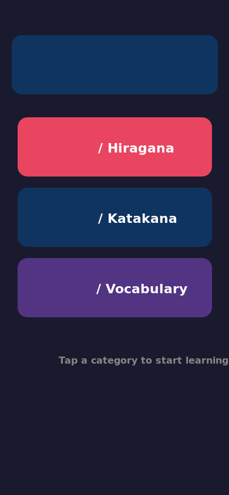
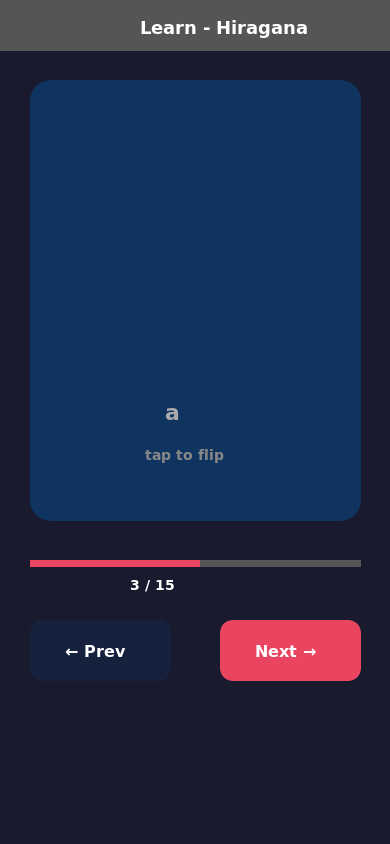
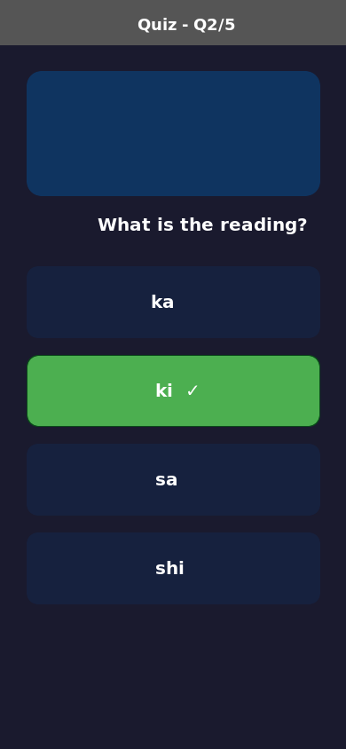
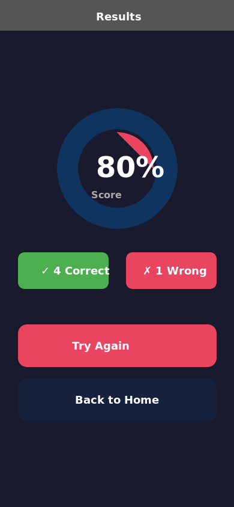

# 🎌 openclaw-nihongo-dojo

> 由 [OpenClaw](https://github.com/openclaw/openclaw) AI Agent 团队协作开发的日语学习应用

---

## 截图预览

| 首页 | 学习页 | 测验页 | 结果页 |
|------|--------|--------|--------|
|  |  |  |  |

---

## 项目简介

**Nihongo Dojo（日语道场）** 是一款面向中文母语者的日语入门学习 App，聚焦假名（平假名 / 片假名）与基础词汇的学习与测验。

本项目全程由 OpenClaw 多 Agent 协作完成，包括：
- **Agent-PM** — 项目规划与任务协调
- **Agent-Backend** — 数据库设计与 Repository 接口
- **Agent-Frontend** — React Native 界面开发
- **Agent-QA** — 测试计划与质量保障

---

## 功能特性

- 📖 **学习模式** — 卡片式展示假名与单词，点击翻转查看读音
- 🧪 **测验模式** — 多选题随机测验，即时反馈正误
- 📊 **结果统计** — 得分展示、正确率分析
- 🗃️ **本地数据** — SQLite 存储，离线可用（MVP 阶段）
- 🔤 **覆盖范围** — 平假名、片假名（92 个）、基础词汇（50+，含 JLPT N5 分级）

---

## 技术栈

| 层次 | 技术 |
|------|------|
| 前端框架 | React Native + Expo |
| 语言 | TypeScript |
| 导航 | React Navigation |
| 本地数据库 | SQLite（expo-sqlite） |
| 数据层 | Repository 模式 |

---

## 项目结构

```
nihongo-app/
├── frontend/               # React Native 前端
│   ├── src/
│   │   ├── screens/        # 页面：首页 / 学习 / 测验 / 结果
│   │   ├── navigation/     # 路由配置
│   │   ├── db/             # SQLite Repository
│   │   └── data/           # 数据服务层
│   └── App.tsx             # 应用入口
├── backend/                # 数据库设计与接口规范
│   ├── schema.sql          # 数据库表结构
│   ├── seed_kana.sql       # 假名初始数据（92 条）
│   ├── seed_words.sql      # 基础词汇数据（50 条）
│   └── API.md              # Repository 接口文档
└── tests/
    └── MVP-TestPlan.md     # MVP 测试计划
```

---

## 快速开始

```bash
# 克隆仓库
git clone git@github.com:zjyellow/openclaw-nihongo-dojo.git
cd openclaw-nihongo-dojo/frontend

# 安装依赖
npm install

# 启动开发服务器
npm start

# 运行 Android
npm run android
```

---

## 路线图

- [x] 假名学习与测验（MVP）
- [x] 基础词汇数据（50 词，JLPT N5）
- [ ] 音频朗读功能
- [ ] 卡片翻转动画
- [ ] 学习进度记录（SRS 间隔重复）
- [ ] 远程 API 对接
- [ ] iOS 支持

---

## 开发团队

本项目由 **OpenClaw** 驱动的 AI Agent 团队开发。  
OpenClaw 是一个开源的 AI 助手框架，支持多 Agent 协作完成复杂任务。

- 🔗 [OpenClaw GitHub](https://github.com/openclaw/openclaw)
- 💬 [OpenClaw Discord](https://discord.com/invite/clawd)

---

## License

MIT
